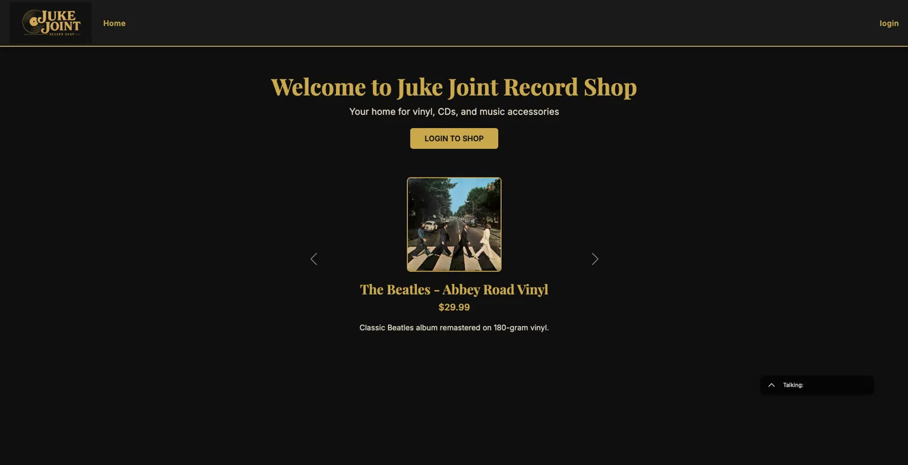
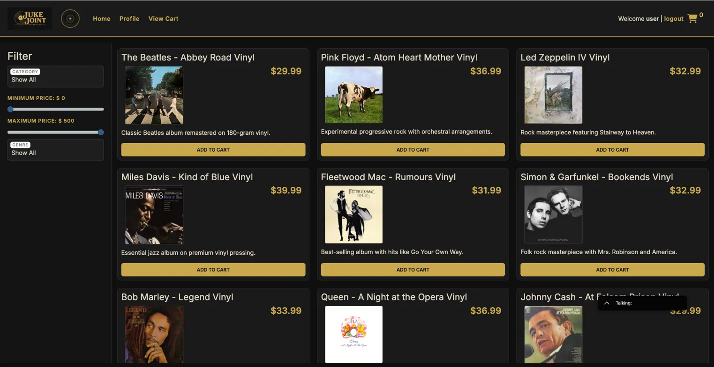
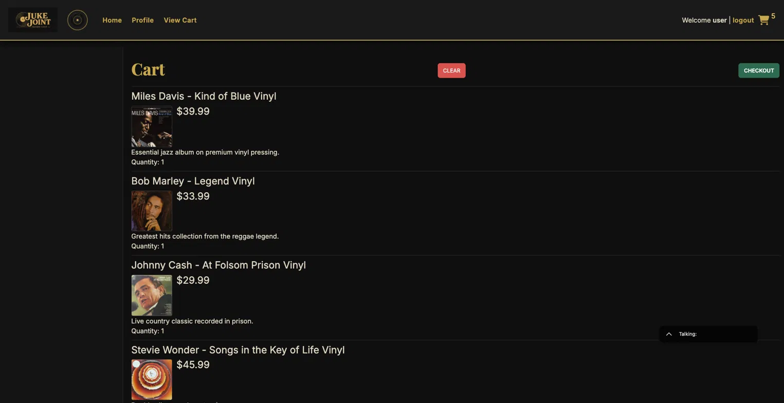

# 🎵 Juke Joint Record Shop

A full-stack e-commerce application for a vinyl record shop, built as a capstone project for Year Up United's Java Focus Academy. The backend is a Spring Boot REST API connected to a MySQL database, with a custom-styled vanilla JS frontend.

---

## 🖥️ Application Screenshots

### Landing Page (Logged Out)


### Store (Logged In)


### Shopping Cart


---

## ✨ Features

- Browse vinyl records, CDs, and music accessories
- Filter products by category, genre, and price range
- User registration and login with JWT authentication
- Add items to a persistent shopping cart
- View and update your profile
- Checkout — converts cart into a saved order
- Admin-only category and product management
- Featured product carousel on the landing page

---

## 🛠️ Tech Stack

**Backend**
- Java 17
- Spring Boot 4
- Spring Security + JWT
- Spring Data JPA / Hibernate
- MySQL

**Frontend**
- HTML, CSS, JavaScript
- Bootstrap 5
- Mustache.js templating
- Axios

---

## 🚀 Setup Instructions

### Prerequisites
- Java 17+
- MySQL
- Maven

### Database Setup
1. Open MySQL Workbench
2. Run `create_database_recordshop.sql`
3. This creates the `recordshop` database with sample products and users

### API Setup
1. Clone the repository
2. Open `capstone-api-starter` in IntelliJ
3. Update `src/main/resources/application.properties`:
```properties
spring.datasource.url=jdbc:mysql://localhost:3306/recordshop
spring.datasource.username=root
spring.datasource.password=yourpassword
```
4. Run `ECommerceApplication.java`
5. API runs on `http://localhost:8080`

### Frontend Setup
1. Open `capstone-client-recordshop` in VS Code
2. Right-click `index.html` → Open with Live Server
3. Frontend runs on `http://127.0.0.1:5500`


---


---

## 👩🏾‍💻 Developer

**Justine Oyaghiro**  
Year Up United — Java Focus Academy  
Atlanta, GA  
[GitHub](https://github.com/joyagh)


